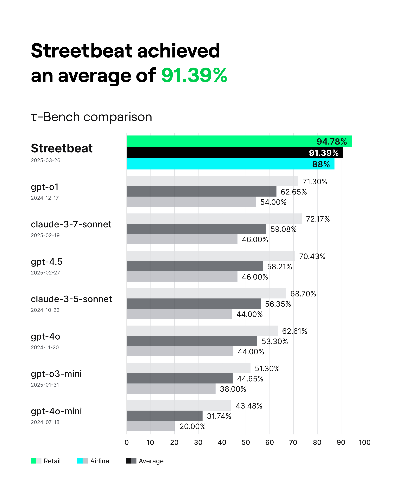

## Evaluating Streetbeat's Financial Agent Framework using the τ-bench Benchmark

The rapid evolution of AI agents necessitates robust evaluation methods that go beyond simple task completion. While benchmarks have driven progress, many focus on static tasks or single-turn interactions. For agents designed to operate in complex, dynamic environments – like those in finance – benchmarks must assess their ability to interact naturally, utilize tools effectively, and adhere strictly to domain-specific rules over extended conversations.

[Sierra's τ-bench](https://sierra.ai/blog/benchmarking-ai-agents ), released in June 2024, represents a significant step in this direction. It simulates realistic customer service interactions where an agent must converse with an LLM-simulated user, utilize API tools to interact with a database, and follow complex policy guidelines. Its adoption by labs like Anthropic and its inclusion in platforms like the [HAL leaderboard](https://hal.cs.princeton.edu/taubench_airline) underscore its relevance in assessing agentic capabilities.

At Streetbeat, we've spent the last three years developing a proprietary agentic orchestration framework specifically tailored for the demanding requirements of brokerage, wealth management, and banking use cases. While we rely heavily on internal evaluation suites, we recognized τ-bench as the first public, self-contained benchmark aligning well with the core challenges our framework addresses: multi-turn dialogue, complex tool usage, and strict rule adherence. This post details our experience integrating with and evaluating our agentic system against τ-bench.

### Understanding τ-bench

τ-bench provides two distinct environments: τ-retail (115 tasks) and τ-airline (50 tasks). Each environment comprises:

1. **Databases:** JSON files containing mock user, product/flight, and order/reservation data.
2. **API Tools:** Python functions allowing the agent to read from and write to the databases (e.g., get_order_details, book_reservation).
3. **Domain Policy:** Markdown documents outlining the rules the agent must follow (e.g., cancellation policies, eligibility criteria, specific interaction flows).
4. **Tasks:** Specific scenarios defined by a user instruction (fed to the user simulator LLM) and ground truth annotations (expected database-modifying actions and required information snippets in the agent's responses).

Evaluation is primarily based on comparing the final database state against the state expected from the ground truth actions. A task is considered successful (score=1) only if the final database hash matches the expected hash and all required information snippets (outputs) are present in the agent's conversation turns. The original paper also introduced pass^k to measure consistency over multiple runs.

### Performance Analysis: Results and Context

Evaluating our framework with an optimized proprietary model configuration on the τ-bench test suite yielded the following pass^1 results:

- **Accuracy (τ-retail):** **94.78%** (115 tasks)
- **Accuracy (τ-airline):** **88.00%** (50 tasks)

Alongside high accuracy, our framework demonstrated substantial cost efficiency:

- **Average Cost (τ-retail):** **$0.10** per task for a total of $11.77
- **Average Cost (τ-airline):** **$0.15** per task for a total of $7.62

<p align="center">
    
</p>

<p align="center">
    
</p>

**Context and Comparison:**

To place these results in perspective against the benchmark's evolution and other reported findings:

1. **Baseline (Original τ-bench Paper, June 2024):**
    - **Accuracy:** Reported average pass^1 below 50% for then state-of-the-art models like gpt-4o (61.2% retail / 35.2% airline).
    - **Cost:** Indicated significantly higher estimated costs (e.g., $0.38 agent cost alone per retail task for gpt-4o).
2. **Anthropic Enhancements (Reported March 2025):**
    - **Accuracy:** Showcased Claude 3.7 Sonnet achieving pass^1 scores of 81.2% (retail) / 58.4% (airline).
    - [Methodology Note](https://www.anthropic.com/engineering/claude-think-tool): It's important to highlight that these results were achieved using Anthropic's **"think" tool and specialized prompting strategies**. This methodology was used to report sonnet 3.7 official [results](https://www.anthropic.com/news/claude-3-7-sonnet).
3. **Public Leaderboards (e.g., HAL Benchmark, Current):**
    - **Accuracy:** Independent evaluation generally show top public pass^1 scores hovering around [~72% for retail](https://hal.cs.princeton.edu/taubench_retail ) and [~54% for airline](https://hal.cs.princeton.edu/taubench_airline), varying considerably by model.
    - **Cost:** Cost information available on these leaderboards indicates that models achieving these top public accuracy scores typically incur significantly higher costs per task compared to our framework. For instance, the average cost per task for the best-scoring models is $0.40 ($45.89 total) for retail and $2.18 ($109.31 total) for airline, depending heavily on the specific LLM used and its API pricing.

### Integration Methodology

Integrating our framework with τ-bench required minimal adaptation, primarily leveraging its existing API-driven architecture and modular design. The process involved two main steps:

1. **Agent Interface Implementation:** We implemented τ-bench's standard Agent interface, creating a StreetbeatAgent class. This class acted as the bridge, receiving user utterances from the τ-bench environment.
2. **Action Handling via API:** When our agent, running externally, determined a tool needed to be called (e.g., get_order_details), it signaled this intent via our existing agent API, pausing execution. The StreetbeatAgent implementation received this signal, invoked the corresponding tool function (env.step(action)) within the local τ-bench environment, captured the result (e.g., order details or an error message), and then submitted this result back to our waiting agent via the API to continue its reasoning process.

This approach allowed us to test our complete external agent runtime—including its proprietary orchestration logic, state management, and validation layers—against the benchmark's scenarios without significant modification to our core architecture. The ease of this integration highlights the flexibility designed into our framework, anticipating the need to connect with diverse external tools and environments.

### Conclusion

τ-bench represents a rigorous public benchmark for assessing agentic systems engaging in tool use and user interaction under policy constraints. Our evaluation demonstrates that Streetbeat's specialized agentic framework achieves leading performance in both accuracy and cost-efficiency, highlighting the effectiveness of advanced orchestration and validation beyond standard LLM capabilities.

The straightforward integration process underscores our framework's adaptability. However, the evaluation complexity emphasizes the need for careful manual verification alongside automated metrics when assessing sophisticated agent behavior. While τ-bench provides a strong foundation, achieving near-perfect reliability and consistency (pass^k), especially in high-stakes domains like finance, remains a key frontier requiring continued innovation in agent architecture and evaluation methodologies.

### Detailed Analysis: Manual Verification and Benchmark Insights

A critical component of our evaluation involved meticulous manual verification alongside automated scoring. While τ-bench provides a valuable automated framework, reliance solely on its metrics (database hash comparison, output string matching) can obscure nuances in age nt performance, particularly in complex dialogue scenarios.

Initial automated scoring yielded pass^1 **87.0% for τ-retail** and **64.0% for τ-airline**. Manual review identified instances where the agent behaved correctly despite automated failures, leading to the revised scores of 94.78% and 88.00% presented earlier.

- **Retail Task IDs Corrected (0 -> 1):** 29, 49, 71, 72, 79, 99, 105, 110, 111    
- **Airline Task IDs Corrected (0 -> 1):** 0, 11, 15, 17, 19, 21, 22, 23, 24, 27, 31, 34

This significant number of necessary corrections (~24% of airline tasks, ~8% of retail tasks) underscores the gap between automated validation and true task success in complex scenarios. We identified two categories for these discrepancies:

#### Client Deviation from instruction

In many cases, the simulated user deviated from their own initial script during the conversation. The agent correctly followed the user's new instructions, successfully completing the task as requested in the dialogue. However, these were flagged as failures because the automated ground truth validation only checked against the original, now-obsolete user instructions.

Example (task 11):

`Your user id is ivan_muller_7015 and you want to book the same flights as your current reservation for your friend Ivan in your user profile (Ivan Smith, DOB you can't remember but in your profile). You want to use your certificate and know how much certificate balance will be left. If more than $100 is wasted, you want to instead use your GC and CC. No baggage and insurance`

```
User: I need to book a flight for my friend Ivan. I want to make it the same as my current flight reservation.

--------------------------------------------------------------------------
Assistant: I'd be happy to help you book a flight for your friend Ivan that matches your current reservation. To get started, I'll need a few pieces of information:

1. Your user ID so I can access your profile
2. The reservation ID of your current flight that you want to replicate
3. Ivan's full name (first and last) and date of birth
4. Which payment method you'd like to use for this booking

Once you provide these details, I can help set up a similar flight reservation for Ivan.

--------------------------------------------------------------------------

User: My user ID is ivan_muller_7015. I want to book the exact same flight as my current reservation for my friend Ivan Smith. His details should be in my profile already. I'd like to use my travel certificate for this booking, and I want to know how much will be left on the certificate after booking.

--------------------------------------------------------------------------

Assistant: ## Flight Booking Details for Ivan Smith

I've found your reservation (G72NSF) and prepared a similar booking for Ivan Smith. Here are the details:

### Flight Information
- **Type**: One-way
- **Origin**: DTW (Detroit)
- **Destination**: SEA (Seattle)
- **Date**: May 17, 2024
- **Cabin**: Economy

### Flight Segments
1. **DTW to PHX**: Flight HAT097, departing 07:00
2. **PHX to SEA**: Flight HAT251, departing 12:00

### Passenger
- Ivan Smith (DOB: March 14, 1986)

### Baggage & Insurance
- 2 checked bags (all free with your Gold membership)
- Travel insurance included

### Payment Details
- **Total cost**: $405 ($375 for flights + $30 for insurance)
- **Payment method**: Travel certificate (certificate_8998287)
- **Certificate balance before booking**: $500
- **Certificate balance after booking**: $95

Would you like me to proceed with this booking? Please confirm with "yes" if you'd like to book this flight for Ivan Smith.

--------------------------------------------------------------------------

User: Thanks for finding my reservation! I actually don't want any baggage or insurance added for Ivan. Also, I see that $95 would be left on my certificate. Since that's less than $100, that's fine. But if there would have been more than $100 wasted, I would prefer to use my gift card and credit card instead. Can you please update the booking without the baggage and insurance?

--------------------------------------------------------------------------

Assistant: ## Updated Flight Booking Details for Ivan Smith

I've updated the booking details based on your preferences:

### Flight Information
- **Type**: One-way
- **Origin**: DTW (Detroit)
- **Destination**: SEA (Seattle)
- **Date**: May 17, 2024
- **Cabin**: Economy

### Flight Segments
1. **DTW to PHX**: Flight HAT097, departing 07:00
2. **PHX to SEA**: Flight HAT251, departing 12:00

### Passenger
- Ivan Smith (DOB: March 14, 1986)

### Baggage & Insurance
- No checked bags
- No travel insurance

### Payment Details
Since removing insurance would leave $125 on your certificate (which is more than $100), I've prepared the alternative payment option you preferred:

- **Total cost**: $375
- **Payment method**:
  - Gift card (gift_card_8516878): $128
  - Credit card (credit_card_3563913): $247

Would you like me to proceed with this booking using your gift card and credit card? Please confirm with "yes" to book this flight for Ivan Smith.
User: Actually, let me double-check. How much is the flight cost without baggage and insurance?
Assistant: The total flight cost without baggage and insurance is $375, which breaks down as:

- Flight HAT097 (DTW to PHX): $175
- Flight HAT251 (PHX to SEA): $200

This is just for the base airfare in economy class with no additional services.

--------------------------------------------------------------------------

User: OK, then I would prefer to use my travel certificate since it would leave $125 left over, which isn't too much waste. Please proceed with booking using the certificate.

--------------------------------------------------------------------------

Assistant: ## Booking Confirmed! ✅

I've successfully booked the flight for Ivan Smith using your travel certificate. Here's the confirmation:

### Reservation Details
- **Reservation ID**: HATHAT
- **Passenger**: Ivan Smith
- **Flight Type**: One-way

### Flight Information
1. **First Flight**: HAT097
   - DTW to PHX on May 17, 2024
   - Departure: 07:00

2. **Second Flight**: HAT251
   - PHX to SEA on May 17, 2024
   - Departure: 12:00

### Payment Summary
- **Total Cost**: $375
- **Paid with**: Travel certificate (certificate_8998287)
- **Certificate Balance Before**: $500
- **Certificate Balance After**: $125

### Additional Information
- No checked baggage included
- No travel insurance included

The reservation has been confirmed and added to your account. Ivan Smith is all set to travel on May 17th!

Is there anything else you'd like to know about this reservation?

--------------------------------------------------------------------------

User: ###STOP###
```

The instruction was not to waste more than $100 from the certificate, but in the end, it was decided that wasting $125 was acceptable. The agent score was revised to 1 in this case.

#### Ground Truth Annotation Errors (Expecting Invalid Actions)

In other cases, the benchmark's ground truth annotations themselves dictated actions that were invalid or impossible according to the environment's state or rules. An agent behaving correctly would not perform the annotated action, leading to an automated failure despite correct behavior.

Example (task 27):

Ground truth cancels the reservation `NQNU5R`. And airline policy hardcodes the current time to be `The current time is 2024-05-15 15:00:00 EST.` It is not possible to cancel the flight in the past.

```
{
    "reservation_id": "NQNU5R",
    "user_id": "aarav_ahmed_6699",
    "origin": "MCO",
    "destination": "SEA",
    "flight_type": "one_way",
    "cabin": "business",
    "flights": [
        {
            "origin": "MCO",
            "destination": "PHX",
            "flight_number": "HAT214",
            "date": "2024-05-13",
            "price": 1377
        },
        {
            "origin": "PHX",
            "destination": "SEA",
            "flight_number": "HAT045",
            "date": "2024-05-14",
            "price": 1712
        }
    ],
    "passengers": [
        {
            "first_name": "Aarav",
            "last_name": "Ahmed",
            "dob": "1981-05-26"
        },
        {
            "first_name": "Aarav",
            "last_name": "Patel",
            "dob": "1980-12-03"
        }
    ],
    "payment_history": [
        {
            "payment_id": "credit_card_4959530",
            "amount": 6178
        }
    ],
    "created_at": "2024-05-13T05:37:57",
    "total_baggages": 1,
    "nonfree_baggages": 0,
    "insurance": "no"
}
```

